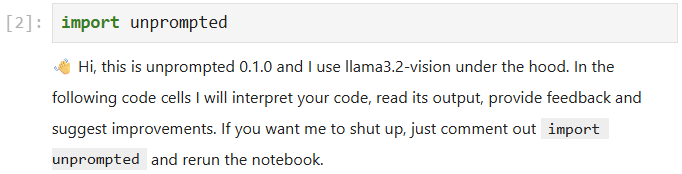
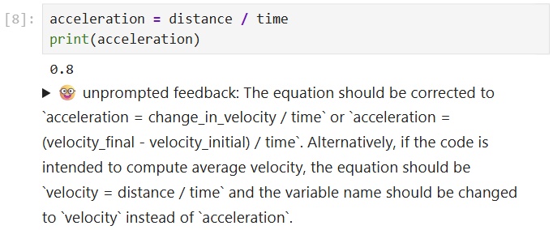

# Unsolicited

A Jupyter notebook extension that provides AI-powered feedback on your code execution and outputs. It uses the [Gemma3:4b](https://ollama.com/library/gemma3:4b) model via [Ollama](https://ollama.com) to analyze your code and provide suggestions for improvements.





`unprompted` is a research tool intended to streamline data analysis experience by identifying issues in code early. It is under development and certainly not perfect. Under the hood it uses large language models, which may do mistakes. Read and respect feedback carefully before following it.

## Prerequisites

- Python 3.9+
- [Ollama](https://ollama.com/) installed and running locally
- An NVidia GPU with > 4 GB memory is recommended

## Installation

1. Install the required Python packages:
```bash
pip install -r requirements.txt
```

2. Install and start Ollama:
- Follow the installation instructions at [ollama.com](https://ollama.com/)
- Start the Ollama server (this happens automatically on Windows)
- Download the Gemma model:

```bash
ollama pull gemma3:4b
```

Models that also work (technically; quality wasn't measured yet)
* [gemma3:4b](https://ollama.com/library/gemma3:4b) 
* [gemma3:12b](https://ollama.com/library/gemma3:12b) 
* [llama3.2-vision](https://ollama.com/library/llama3.2-vision)
* [qwen2.5vl:7b](https://ollama.com/library/qwen2.5vl:7b)

## Usage

1. In your Jupyter notebook, import the extension:
```python
import unprompted
```

2. The extension will automatically analyze your code when executed and check if outputs align with the code. It will make suggestions if necessary.

3. To disable the extension, simply comment out the import statement:
```python
# import unprompted
```

